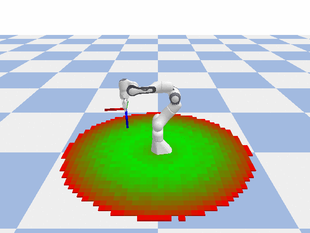
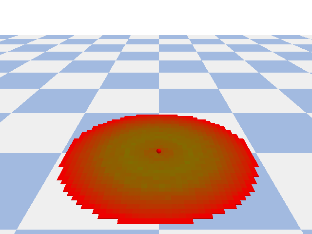
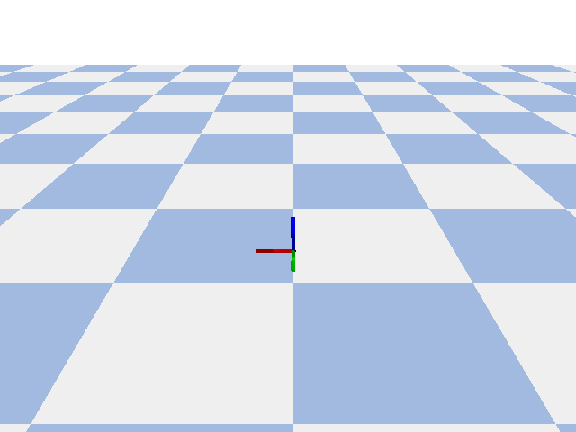

# RM4D

| **RM4D: A Combined Reachability and Inverse Reachability Map for Common 6-/7-axis Robot Arms by Dimensionality Reduction to 4D** |
|:--------------------------------------------------------------------------------------------------------------------------------:|
|                            by [Martin Rudorfer](https://mrudorfer.github.io), presented at ICRA 2025                             |

**Abstract** 
<small>
Knowledge of a manipulator's workspace is fundamental for a variety of tasks including robot design, grasp planning and robot base placement. Consequently, workspace representations are well studied in robotics. Two important representations are reachability maps and inverse reachability maps. The former predicts whether a given end-effector pose is reachable from where the robot currently is, and the latter suggests suitable base positions for a desired end-effector pose. Typically, the reachability map is built by discretizing the 6D space containing the robot's workspace and determining, for each cell, whether it is reachable or not. The reachability map is subsequently inverted to build the inverse map. This is a cumbersome process which restricts the applications of such maps. In this work, we exploit commonalities of existing six and seven axis robot arms to reduce the dimension of the discretization from 6D to 4D. We propose Reachability Map 4D (RM4D), a map that only requires a single 4D data structure for both forward and inverse queries. This gives a much more compact map that can be constructed by an order of magnitude faster than existing maps, with no inversion overheads and no loss in accuracy. Our experiments showcase the usefulness of RM4D for grasp planning with a mobile manipulator.
</small>

A pre-print is available on [arxiv](https://arxiv.org/abs/2410.06968).

<iframe width="560" height="315" src="https://www.youtube.com/embed/BfJ3zGLuQNk?si=cX7rU42c6u-b2WkB" title="YouTube video player" frameborder="0" allow="accelerometer; autoplay; clipboard-write; encrypted-media; gyroscope; picture-in-picture; web-share" referrerpolicy="strict-origin-when-cross-origin" allowfullscreen></iframe>

---

RM4D as a forward map predicts whether a certain TCP pose is reachable by the robot: 

RM4D as inverse map can suggest suitable base positions for a given TCP position: 

And also for specific TCP poses: 

